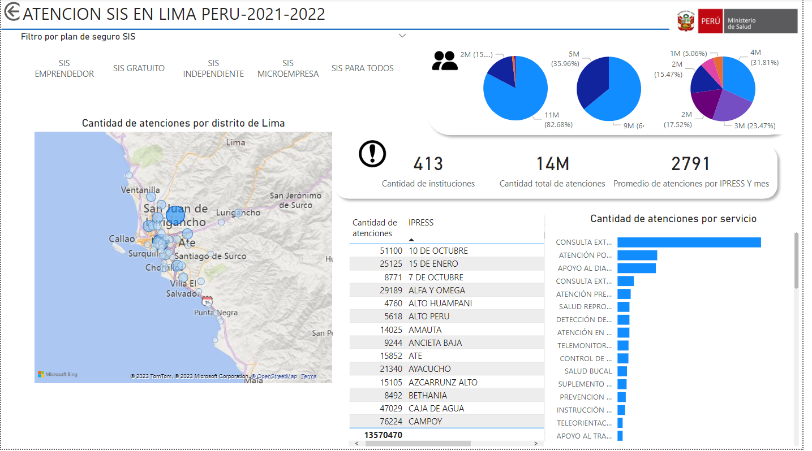
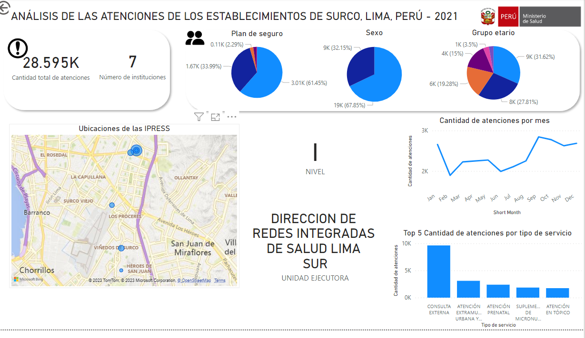

# Análisis de las atenciones del SIS EN LIMA METROPOLITANA 2021 y 2022

El siguiente trabajo consiste en el análisis de la cantidad de atenciones de asegurados del SIS, Lima, Peru. 

Dataset:
El dataset fue obtenido desde el siguiente [link](https://www.datosabiertos.gob.pe/dataset/datos-de-atenciones-realizadas-las-asegurados-seguro-integral-de-salud-sis)

Diccionario:
El siguiente diccionario describe los datos de las tablas del dataset. 

| ATRIBUTO              	| DESCRIPCIÓN                                   	| TIPO DATO         	|
|-----------------------	|-----------------------------------------------	|-------------------	|
| AÑO                   	| Año de atención                               	| AAAA: Año         	|
| MES                   	| Mes de atención                               	| MM: Mes           	|
| REGION                	| Región de la atención                         	| Alfanumérico(200) 	|
| PROVINCIA             	| Provincia de la atención                      	| Alfanumérico(200) 	|
| UBIGEO_DISTRITO       	| Código del Ubigeo del distrito de la Atención 	| Alfanumérico(6)   	|
| DISTRITO              	| Distrito de la atención                       	| Alfanumérico(200) 	|
| COD_UNIDAD_EJECUTORA  	| Código de Unidad Ejecutora                    	| Alfanumérico(4)   	|
| DESC_UNIDAD_EJECUTORA 	| Unidad Ejecutora de la Atención               	| Alfanumérico(200) 	|
| COD_IPRESS            	| RENIPRESS                                     	| Alfanumérico(10)  	|
| IPRESS                	| Institución Prestadora de Servicios de Salud  	| Alfanumérico(200) 	|
| NIVEL_EESS            	| Nivel de Establecimiento de Salud             	| Alfanumérico(1)   	|
| PLAN_DE_SEGURO        	| Tipo de seguro SIS                            	| Alfanumérico(50)  	|
| COD_SERVICIO          	| Código Prestacional                           	| Alfanumérico(3)   	|
| DESC_SERVICIO         	| Descripción del Código Prestacional           	| Alfanumérico(50)  	|
| SEXO                  	| Sexo                                          	| Alfanumérico(10)  	|
| GRUPO_EDAD            	| Grupo edad de acuerdo a Normas MINSA Vigente  	| Alfanumérico(10)  	|
| ATENCIONES            	| Cantidad de Atenciones                        	| Numérico          	|

El análisis comprendió el siguiente objetivo:

Analizar la cantidad de las atenciones del SIS en Lima Metropolitana durante el periodo 2021-2022.

Y los objetivos específicos:

1. Filtrar la información respecto a grupo etario, sexo y plan de seguro SIS.
2. Realizar el análisis de la cantidad de atenciones y el promedio de atenciones respecto al distrito y mes.
3. Presentar la cantidad de atenciones respecto al tipo de servicio obtenido.
4. Presentar la cantidad de atenciones de cada IPRESS de tal distrito de Lima. 

Para ello, se realizó un dashboard en POWER BI, realizando las transformaciones respectivas.

La información del dataset estuvo comprendida desde enero de 2021 hasta junio de 2022.

Resultados:

1. En general, se atendieron a más mujeres (63.96%) que a hombres. Se atendieron a más personas comprendidas en el grupo etario de 30-59 años (31.81%) y se atendieron a más personas con plan de SIS gratuito(82.68%).
2. Se realizaron aproxidamente 14 millones de atenciones, y hubo un promedio de 2791 atenciones por IPRESS Y mes. El distrito con más atenciones fue San Juan de Lurigancho, el cual cuenta con 36 IPRESS, y el que menos atenciones tuvo fue San Isidro, con 1 IPRESS.
3. Los tipos de servicios más atendidos fueron consulta externa, atención por emergencia y apoyo al diagnóstico.
4. Las ipress que más atendieron fueron el Instituto nacional de Enfermedades Neoplásicas, el Hospital María Auxiliadora y el Hospital Nacional Docente Madre Niño San Bartolomé, todas pertenecientes al nivel 3. 

Conclusiones

1. Dado que se atendieron más mujeres que hombres, sería bueno ahondar en las causas de la menor atencion de hombres, desde aspectos sociales hasta biológicos (¿Las mujeres se atienden más por ir a sus controles natales o atender a sus hijos?)
2. Sería bueno priorizar las enfermedades, medicinas y medicamentos que lidian con las enfermedades presentes en la población de 30 ahsta 59 años. 
3. Dado que el SIS gratuito es empleado por la mayoría, sería conveniente robustecer este programa y agilizar los procesos.
4. Hubo 14 millones de atenciones, distribuidas de manera desigual en Lima. La cantidad de IPRESS puede estar relacionada con el nivel de pobreza o población de los distritos.
5. Dado que hubo un mayor número de consultas externa y atenciones por emergencia, hay que priorizar y mejorar su flujo de trabajo.
6. Las IPRESS que más atendieron pertenecieron al nivel 3, esto ocurre debido al poco número de instituciones de nivel 3 presentes en la ciudad de Lima y a la cantidad de referencias desde el nivel 1.

# Análisis de las atenciones del SIS EN SANTIAGO DE SURCO 2021

El análisis comprendió el siguiente objetivo:

Analizar la cantidad de las atenciones del SIS en Santiago de Surco durante el periodo 2021.

Y los objetivos específicos:

1. Filtrar la información respecto a grupo etario, sexo y plan de seguro SIS.
2. Presentar el número total de atenciones y el número de instituciones.
3. Presentar el top 5 de tipos de servicio obtenido por cantidad de atenciones.
4. Presentar los meses en los que se realizaron más atenciones. 

Para ello, se realizó un dashboard en POWER BI, realizando las transformaciones respectivas.

La información del dataset estuvo comprendida desde enero hasta diciembre de 2021.

Resultados:

1. En general, se atendieron a más mujeres (67.85%) que a hombres. Se atendieron a más personas comprendidas en el grupo etario de 30-59 años (31.62%) y se atendieron a más personas con plan de SIS gratuito(61.45%).
2. Se realizaron aproxidamente 28585 atenciones y hubo 7 instituciones. 
3. Los tipos de servicios más atendidos fueron consulta externa, atención extramural urbana y perurbana y atención prenatal.
4. Los meses en los que más se atendieron fueron setiembre, octubre, noviembre, diciembre y enero. 

Conclusiones

1. Dado que se atendieron más mujeres que hombres, sería bueno ahondar en las causas de la menor atencion de hombres, desde aspectos sociales hasta biológicos (¿Las mujeres se atienden más por ir a sus controles natales o atender a sus hijos?)
2. Sería bueno priorizar las enfermedades, medicinas y medicamentos que lidian con las enfermedades presentes en la población de 30 hasta 59 años. 
3. Dado que el SIS gratuito es empleado por la mayoría, sería conveniente robustecer este programa y agilizar los procesos.
4. Hay sólo 7 instituciones para una población de surco de 500 mil habitantes (0.0014 instituciones por 1000 personas). [Fuente](https://declara.jne.gob.pe/ASSETS/PLANGOBIERNO/FILEPLANGOBIERNO/4246.pdf)
5. Dado que hubo un mayor número de consultas externa, atención extramural urbana y perurbana y atención prenatal, hay que priorizar y mejorar su flujo de trabajo.
6. Los meses en los que se atendieron más pacientes pertenecieron al ultimo cuatrimestre del año. 

